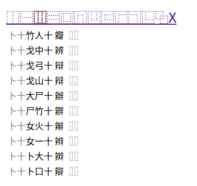
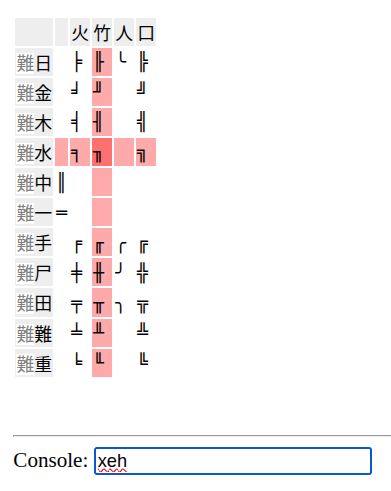

# Cangjie3 Web IME

A browser-based Cangjie Generation 3 Chinese Input Method Editor (IME) built with Vue 3.

Demo: https://antonysigma.github.io/_static/cangjie-bin/


## About

Chinese is a logographic writing system. Instead of spelling words
alphabetically, one composes sentences by visually assembling characters from
structural components.

For decades, Cangjie has been a systematic and efficient way to type Traditional
Chinese by mapping character shapes to keyboard keys **visually**.

However, in today's Mandarin- and phonetic-input–dominated environment, it has
become increasingly difficult to use Cangjie on:

- library or public workstations;
- friends' smartphones or laptops;
- systems where IME installation is restricted.

This project provides a fully client-side, install-free Cangjie Gen-3 IME that
works directly in the browser.

## Features

- Cangjie Generation 3 support
- UTF-8 output
- No installation required
- Open source

## Data and License

The Cangjie code → UTF-8 mapping table is derived from the [IBus project on GitHub](https://github.com/ibus/ibus).
The mapping data therefore inherits the original IBus license terms unchanged.

## Historical Context

For background on the “Chinese input method arms race” of the 1990s:

https://youtu.be/KSEoHLnIXYk?t=2889

This project exists to keep shape-based Chinese input accessible in a web-first
world.

## Advanced usages

### Common punctuations

Frequently used full-width Chinese punctuation marks, for example:

```
。﹐《 》「」『』……；：﹑？
```

can be entered directly from a standard US keyboard using the corresponding keys:

```
.,<>[]{}^:?`
```

### Structural filtering by ideographs

Cangjie is fundamentally a **vision-oriented input method**, designed around
morphological structure of Chinese characters. To highlight its strength, the
IME includes a **visual structure filtering tool** based on
[Ideographs](https://en.wikipedia.org/wiki/Ideographic_Description_Characters).

Users can refine the search of Chinese characters by specifying their structural
composition visually.

For example, if the user remembers that a character consists of **three
horizontally arranged components (⿲)**, they can visually select that
structural operator from the toolbar:



Similarly, if the character contains a component enclosed along the **left and bottom margins (⿺)**,
they can select the corresponding ideograph:


This filtering mechanism operates at the level of character structure, not phonetics, enabling efficient Chinese typing based on pure spatial compositiion.

The Ideograph database is derived from https://github.com/cjkvi/cjkvi-ids.git .
Currently, only the first-order structural matching (top-level ideograph
decomposition) is implemented.
### Unusual punctuations


When user types `xz`, the IME displays a grid of Chinese-specific punctuations
arranged on a Cartesian coordinate system.

To select a symbol:

1. Choose a row identifier, `a / b / c`;
2. followed by a column identifier `a - z`;
3. then press the space bar to confirm.

The grid UI layout is inspired by the first-generation [Chinese
typewriter](https://en.wikipedia.org/wiki/Chinese_typewriter#/media/File:Chinese_typewriter.jpg),
preserving its spatial selection paradigm in a modern web interface.

### ASCII Table borders

Table borders and box drawing characters can be inserted by typing `z`. Again, the IME display a grid of box shapes arranged on a Cartesian coordinate system.


