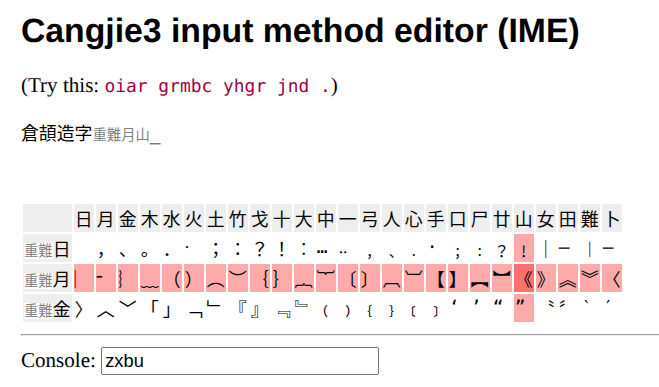

# Cangjie3 Web IME

A browser-based Cangjie Generation 3 Chinese Input Method Editor (IME) built with Vue 3.

https://github.com/antonysigma/cangjie-web

## About

Chinese is a logographic writing system. Instead of spelling words
alphabetically, one composes sentences by visually assembling characters from
structural components.

For decades, Cangjie has been a systematic and efficient way to type Traditional
Chinese by mapping character shapes to keyboard keys **visually**.

However, in today's Mandarin- and phonetic-input–dominated environment, it has
become increasingly difficult to use Cangjie on:

- library or public workstations;
- friends' smartphones or laptops;
- systems where IME installation is restricted.

This project provides a fully client-side, install-free Cangjie Gen-3 IME that
works directly in the browser.

## Features

- Cangjie Generation 3 support
- UTF-8 output
- No installation required
- Open source

## Data and License

The Cangjie code → UTF-8 mapping table is derived from the [IBus project on GitHub](https://github.com/ibus/ibus).
The mapping data therefore inherits the original IBus license terms unchanged.

## Historical Context

For background on the “Chinese input method arms race” of the 1990s:

https://youtu.be/KSEoHLnIXYk?t=2889

This project exists to keep shape-based Chinese input accessible in a web-first
world.